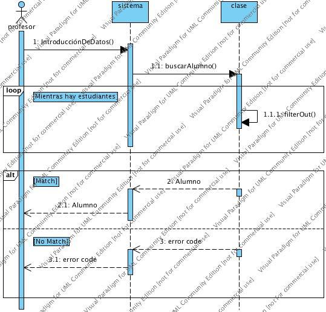
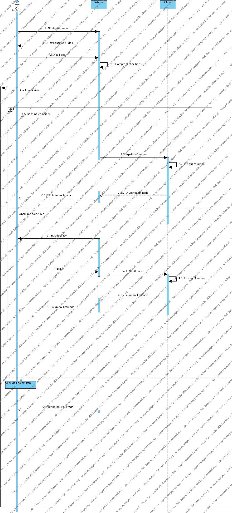
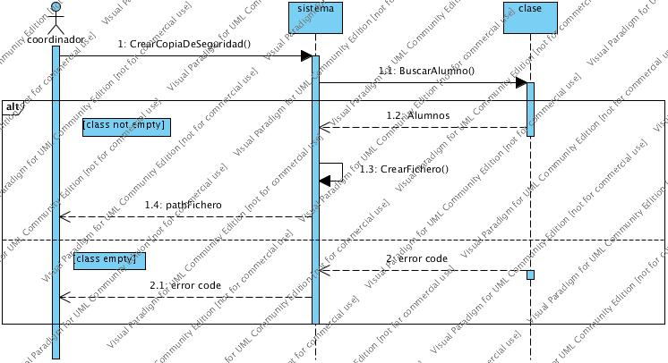
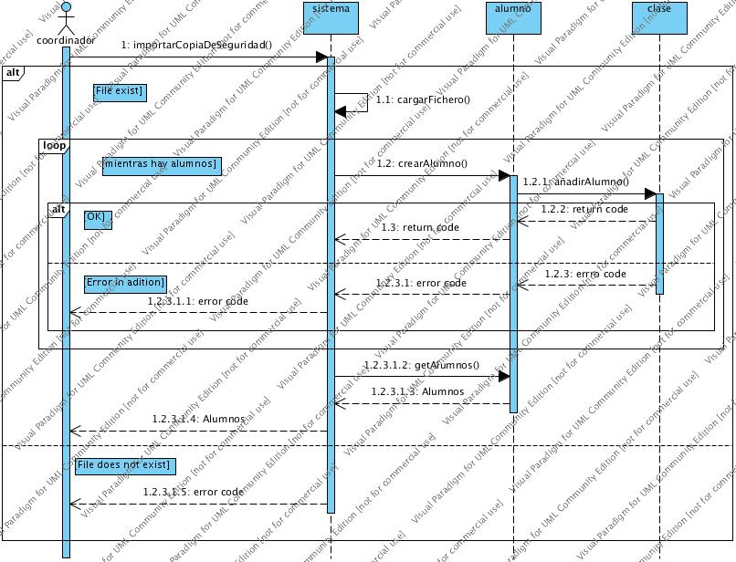
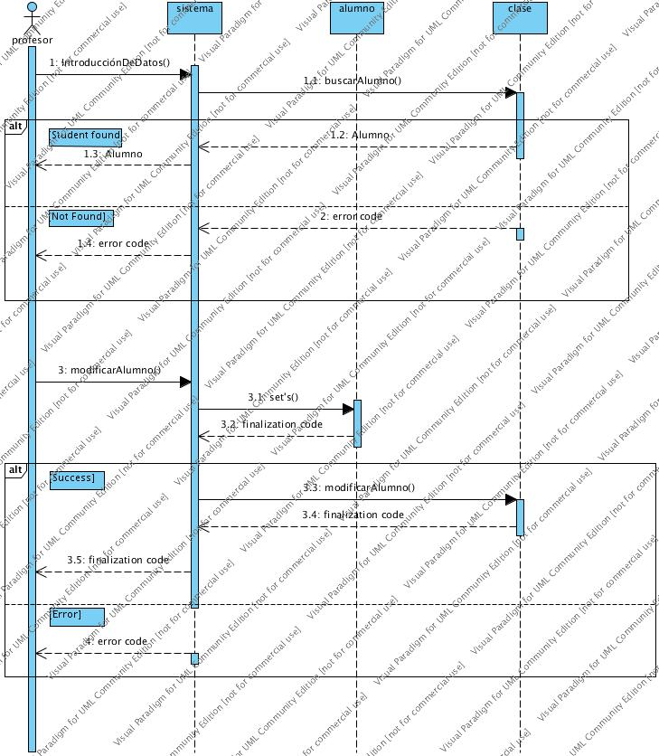

# Acición de un nuevo alumno por parte del personal docente

La propia función 1: IntroducciónDeDatos, le pdirá al profesor los datos necesarios para la creación del alumnado. al profesor se le devolverá la instancia del nuevo alumno creado

# Busqueda da alumno por parte del personal docente

A esta función se le pasara como parametro una estructura de datos con los campos que se quiere que concuerden con los alumnos devueltos por la función si los campos estan vacios, es derir "" este se ignorará en la busqueda.

# Eliminar alumno por parte del personal docente

El profesor introduce los datos del alumno para encontrar al alumno que desea eliminar. Esto llega al sistema y posteriormente se introducirá en clase, dónde a través de la función eliminarAlumno() podremos eliminar el usuario indicado.

# Exportar alumno por parte del profesorado

El profesor del curso podra exportar un alumno a un path, que se le pedirá por pantalla en la función 1:exportarAlumno(), a continuación el sistema hará una búsqueda sin parámetro alguno (retornará una lista de todos los alumnos).

A continuación se creará un fichero en dicho path y se grabará los datos de los alumnos, finalmente, se retornará el path al profesor.

# Exportar una copia de seguridad por parte del coordinador del curso

El coordinador del curso podra exportar una copia de seguridad a un path que se le pedirá por pantalla en la función 1:CrearCopiaDeSeguridad, a continuacion el sistema hara una busqueda sin parametro alguno (retornará una lista de todos los alumnos).

A continuación se creará un fichero en dicho path y se grabará los datos de los alumnos, finalmente, se retornará el path al coordinador.

# Importar una copia de seguridad por parte del coordinador del curso

El coordinador del curso podra importar una copia de seguridad a partir de un path que se le pedirá por pantalla en la función 1:importarCopiaDeSeguridad, a continuacion el sistema Cargara los alumnos en la clase, y devolverá el array de los nuevos alumnos en el sistema.

# Modificacion del alumno por parte del personal docente

El profesor buscará un alumno en el sistema, este le devolverá uno a una lista de alumnos, a continuación el profesor editara la isntancia de uno de los alumnos devueltos, y llamará a 2.3:modificarAlumno() para persistir los cambios en la lista de alumnos de la clase "clase".
Finalmente, el sistema le devolverá la nueva instancia modificada del objeto alumno.

# Mostrar alumno por parte del personal docente

EL profesor le pedirá al sistema que le muestre el alumno por pantalla y el sistema lo que realizará es devolver el alumno indicado por pantalla.

