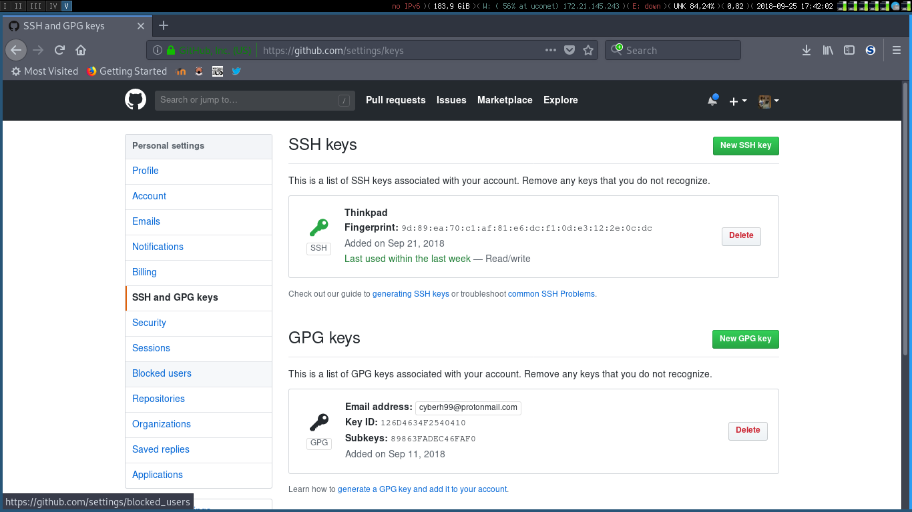

# Github

## ¿Qué es github?

Git es un control de versiones que nos permite trabajar comodamente con múltiples versiones de nuestro código, sin embargo, cuando estamos trabajando en el mundo normal, lo general es estar colaborando con otras personas en el mismo proycto. Esta funcionalidad se realiza de forma más cómoda mediante Github.

**Github es un proyecto independiente a git**

Debemos tener clara la anterior afirmación, puesto que Github simplemente es un repositorio donde podemos encontrar múltiples proyectos cuyo control de versiones es _git_, es una plataforma muy útil de usar para la comunicación entre los diferentes equipos.

Antes de continuar será neceseario obtener nuestra cuenta de [Github](https://www.github.com) 

<center>  </center>

## Sincronización de Github y Git

Cuando estamos trabajando con git estamos haciendo repositorios locales, dichos repositorios estan alojados en nuestro equipo aislados del resto del mundo. Al querer trabajar con Github, será necesario sincronizar los cambios que hagamos en local con los cambios en remoto (dentro de nuestro repositorio Github) para ello tenemos dos opciones de trabajar:

* Autenticación mediante HTTP
* Utilizar claves SSH

### Autenticación HTTP

Consiste en introducir nuestro usuario y contraseña en el caso de que queramos realizar operaciones en remoto ( como pueden ser obtener los cambios o subir nuevos cambios), para ello simplemente tenemos que configurar nuestra cuenta de Github.

### Autenticación con SSH

Github tiene una opción muy útil que consiste en poder sincronizar las claves [ssh](https://en.wikipedia.org/wiki/Ssh) con Github de forma que podamos realizar cambios sin necesidad de introducir nuestro usuario y contraseña de Github. 

Si queremos configurar nuestra clave ssh dentro del repositorio de Github, necesitaremos generarla, para ello introduciremos el siguiente comando en la terminal.

```ssh-keygen -b 4096 ```

De forma que por defecto (aunque podemos cambiarlo dentro del asistente de generación) se guardarán los archivos __id_rsa__ y __id_rsa.pub__ dentro de la carpeta __~/.ssh__ de nuestro usuario, puediendo así copiar el contenido del **último archivo** a la configuración de nuestro perfil de Github:

<center>  </center>
