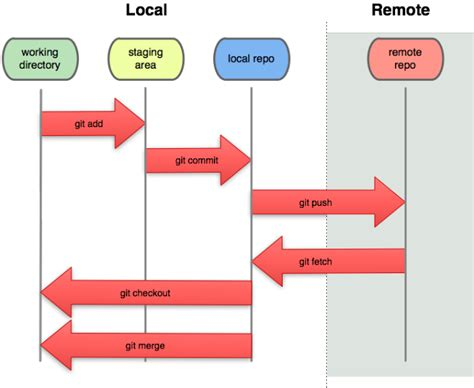

# Introducción
<p align="center">

</p>

Git (pronunciado "guit"​) es un software de control de versiones diseñado por Linus Torvalds, pensando en la eficiencia y la confiabilidad del mantenimiento de versiones de aplicaciones cuando éstas tienen un gran número de archivos de código fuente. Su propósito es llevar registro de los cambios en archivos de computadora y coordinar el trabajo que varias personas realizan sobre archivos compartidos.

Al principio, Git se pensó como un motor de bajo nivel sobre el cual otros pudieran escribir la interfaz de usuario o front end como Cogito o StGIT. Sin embargo, Git se ha convertido desde entonces en un sistema de control de versiones con funcionalidad plena.​ Hay algunos proyectos de mucha relevancia que ya usan Git, en particular, el grupo de programación del núcleo Linux.

El mantenimiento del software Git está actualmente (2009) supervisado por Junio Hamano, quien recibe contribuciones al código de alrededor de 280 programadores. En cuanto a derechos de autor Git es un software libre distribuible bajo los términos de la versión 2 de la Licencia Pública General de GNU.
# Instalación

## sistemas basados en debian

	sudo apt install git
	sudo apt-get install git

## sistemas basados en arch

	sudo pacman -Sy git

## sistemas basados en redhat

	sudo yum install git
	sudo dnf install git

  # Configuración del entorno GIT

  Git tiene ciertos valores por defecto que nos permite comenzar a trabajar después  de la instalación, sin embargo, cuando estamos trabajando en conjunto con otras personas es necesario identificarnos dentro de git, de forma que podamos identificar los commits que estemos realizado. Para ello modificaremos los siguientes parámetros.

  ## Configuración de usuario

  ```
      git config --global user.name "Nombre de usuario"
  ```

  ```
      git config --global user.email "correo_usuario@gmail.com"
  ```

  Con estos sencillos comandos tenemos configurados tanto nuestro nombre de usuario como nuestro correo electrónico de forma que al subir nuestros cambios al repositorio remoto aparezca nuestro nombre en él.

  ## Configuración de un editor por defecto

  Cuando estamos trabajando con git, es posible que obtengamos dieferentes mensajes de error, dichos mensajes de error serán mostrados en un editor de texto (que por defecto es _vim_), podemos cambiar este editor con el siguiente comando.

  ```
      git config --global core.editor editorFavorito
  ```

  Algunos de los editores que podemos poner son:
  * emacs
  * vim
  * nano

  ## Configuración de commits por defecto

  En un entorno de trabajo grande, estaremos haciendo una gran cantidad de commits, es posible tener preconfigurado una plantilla para nuestro commit, para ello usaremos:

  ```
      git config --global commit.template ~/.gitmessage.txt
  ```

  Siendo _~/.gitmessage.txt_ el archivo que contiene la plantilla
  # Uso básico

  ## Los tres estados de Git

  

  ### **Comandos básicos I**

  * Iniciar repositorio en un directorio:  
  git init

  * Agregar cambios al area de *staging*:  
  git add

  * Validar cambios en el repositorio:  
  git commit -m "Mensaje"

  * Hacer los dos pasos anteriores en uno:  
  git commit -am "Mensaje"

  * Historial de commits:  
  git log


  ### **Comandos básicos II**

  * Ayuda del listado anterior:  
  git help log

  * Listar los 5 commits mas recientes:  
  git log -n 5

  * Listar los commits desde una fecha:  
  git log --since=2018-09-18

  * Listar los commits por autor:  
  git log --author="Antonio"

  * Ver cambios en el directorio:  
  git status


  ### **Comandos básicos III**

  * Ver diferencia entre ficheros en el directorio y el repositorio de git:  
  git diff

  * Ver diferencia entre ficheros en el staging y el repositorio:  
  git diff --staged

  * Eliminar archivos:  
  git rm archivo  
  git commit -m "Mensaje"

  * Mover o renombrar archivos:  
  git mv antiguo nuevo  
  git commit -m "Mensaje"


  ### **Comandos básicos IV**  

  * Deshacer cambios con git:  
  git checkout -- nombre_fichero

  * Retirar archivos del staging:  
  git reset HEAD nombre_fichero

  * Complementa ultimo commit:  
  git commit --amend -m "Mensaje"

  * Recuperar version de un fichero de commit antiguo:  
  git checkout <id_commit> -- nombre_archivo

  * Revertir un commit:  
  git revert <id_commit>


  ### **Comandos básicos V**

  * Deshacer multiples cambios en el repositorio:    
  git reset --soft <id_commit>  
  git reset --mixed <id_commit>    
  git reset --hard <id_commit>    

  * Listar archivos que git no controla:    
  git clean -n

  * Eliminar archivos que git no controla:    
  git clean -f

  * Ignorar archivos en el repositorio: .gitignore

  ### **Comandos básicos VI**

  * Listar el contenido del repositorio de git:    
  git ls-tree master  
  git ls-tree masterˆˆˆ  
  git ls-tree master ̃ 3  

  * Log en una línea:  
  git log --oneline  

  * Log con los tres últimos commits en una línea:  
  git log --oneline -3

  * Para más opciones consultar documentación de git.  

  ### **Comandos básicos VII**

  * Examinar el contenido de un commit:  
  git show <id>

  * Comparar un commit con el actual:  
  git diff <id> nombre_archivo

  * Comparar dos commits:  
  git diff id..id nombre_archivo
  # Ramas
  ## ¿Qué son las ramas?
  Es la forma para separar la lı́nea actual de desarrollo con respecto a la principal. Normalmente representan versiones del software que posteriormente son integradas a la lı́nea principal.

    

  ## ¿Cómo me puedo aprovechar de ellas?
  Cuando vamos a trabajar en una nueva funcionalidad, es conveniente hacerlo en una nueva rama, para no modificar la rama principal y dejarla inestable.

  ### preparacion del ejemplo.
  Para poder llevar a acabo el ejemplo, haremos, (en un directorio vacío) lo siguiente:  

  	git init && touch .gitignore && git add * && git commit -m "initial commit"

  ### Vamos a crear una rama.

  !!! info
  	Si usamos git branch sin ningún argumento, nos devolverá la lista de ramas disponibles.

  Una vez hemos comprobado que no existe una rama 'test' podemos proceder a su creación.

  	$ git chechout -b hola
  	Switched to branch 'hola'

  <!-- TODO: match the previous file and modify it -->

  ### Modificamos la nueva rama.
  para esto añadiremos un simple hola mundo en SH, creamos un documento nuevo, llamado "HelloWorld.sh" en el cual escribiremos:

  	#!/bin/sh
  	printf "hello, world\n"

  ### Salvamos las modificaciones a la rama.
  	$ git add HelloWorld.sh
  	$ git commit -m "Añadido script hola mundo"
  	[hola daae9ca] Añadido script hola mundo
  	1 file changed, 3 insertions(+)
  	create mode 100644 HelloWorld.sh

  ### Merge al master.
  Una vez provado el nuevo cambio, vemos que no da errores, entonces decidimos implementarlo al master, para ello, nos iremos al master:

  	$ git checkout master

  y haremos mergin desde la rama hola, a la rama master.

  	$ git merge hola
  	Updating daae9ca..787590a
  	Fast-forward
  	HelloWorld.sh | 2 +-
  	1 file changed, 1 insertion(+), 1 deletion(-)

  ### mergin

  A continuación forzaremos una situacion de conflicto entre ramas, para ello modificaremos el script en las dos ramas a la vez.  

  en la rama master, editaremos el script añadiendo una exclamación al final del printf.

  	#!/bin/sh
  	printf "hello, world!\n"

  A continuacion haremos un commit de lo modificado

  	$ git commit -am "added \!"


  en la rama hola, añadiremos una interrogación, para ello, nos cambiamos a la rama hola:

  	$ git checkout hola

  y editamos el script:

  	#!/bin/sh
  	printf "hello, world?\n"

  A continuacion haremos un commit de lo modificado

  	$ git commit -am "added ?"


  ahora volveremos a la rama master e intentaremos hacer mergin.

  	$ git merge hola
  	Auto-merging HelloWorld.sh
  	CONFLICT (content): Merge conflict in HelloWorld.sh
  	Automatic merge failed; fix conflicts and then commit the result.

  Esto indica que el mergin fallo en le archivo HelloWorld.sh y que debemos arreglarlo a mano, para ello, abriremos el script de nuevo, esta vez observaremos que unas marcas se han añadido:

  	#!/bin/sh
  	<<<<<<< HEAD
  	printf "hello, world!\n"
  	=======
  	printf "hello, world?\n"
  	>>>>>>> hola


  Estas marcas lo que indican el trozo de código que ha entrado en conflicto, para arreglarlo eliminaremos uno u otro, y procederemos a hacer commit de lo realizado, para este problema, escogeremos el contenido de la rama hola.

  	#!/bin/sh
  	printf "hello, world?\n"


  	$ git commit -am "fixed mergin problem with branch \"hola\""
# Github

## ¿Qué es github?

Git es un control de versiones que nos permite trabajar comodamente con múltiples versiones de nuestro código, sin embargo, cuando estamos trabajando en el mundo normal, lo general es estar colaborando con otras personas en el mismo proycto. Esta funcionalidad se realiza de forma más cómoda mediante Github.

**Github es un proyecto independiente a git**

Debemos tener clara la anterior afirmación, puesto que Github simplemente es un repositorio donde podemos encontrar múltiples proyectos cuyo control de versiones es _git_, es una plataforma muy útil de usar para la comunicación entre los diferentes equipos.

Antes de continuar será neceseario obtener nuestra cuenta de [Github](https://www.github.com)

<p align="center"></p>

## Sincronización de Github y Git

Cuando estamos trabajando con git estamos haciendo repositorios locales, dichos repositorios estan alojados en nuestro equipo aislados del resto del mundo. Al querer trabajar con Github, será necesario sincronizar los cambios que hagamos en local con los cambios en remoto (dentro de nuestro repositorio Github) para ello tenemos dos opciones de trabajar:

* Autenticación mediante HTTP
* Utilizar claves SSH

### Autenticación HTTP

Consiste en introducir nuestro usuario y contraseña en el caso de que queramos realizar operaciones en remoto ( como pueden ser obtener los cambios o subir nuevos cambios), para ello simplemente tenemos que configurar nuestra cuenta de Github.

En el caso de estar trabajando con claves HTTP, para ahorrar tiempo podemos introducir la contraseña en caché de forma que no la requiera cada vez que tengamos que realizar operaciones remotas, para ello es necesario activar la caché mediante el siguiente comando:
```
    git config --global credential.helper 'cache --timeout=3600'
```

### Autenticación con SSH

Github tiene una opción muy útil que consiste en poder sincronizar las claves [ssh](https://en.wikipedia.org/wiki/Ssh) con Github de forma que podamos realizar cambios sin necesidad de introducir nuestro usuario y contraseña de Github.

Si queremos configurar nuestra clave ssh dentro del repositorio de Github, necesitaremos generarla, para ello introduciremos el siguiente comando en la terminal.

```ssh-keygen -b 4096 ```

De forma que por defecto (aunque podemos cambiarlo dentro del asistente de generación) se guardarán los archivos __id_rsa__ y __id_rsa.pub__ dentro de la carpeta __~/.ssh__ de nuestro usuario, puediendo así copiar el contenido del **último archivo** a la configuración de nuestro perfil de Github:

<p align="center"> </p>

## Convertir un repositorio en remoto

Como se ha mencionado con anterioridad, cuando estamos trabajando con git lo estamos haciendo de forma local, sin embargo cuando queremos sincronizar dichos cambios con Github, simplemente tenemos que indicarle a git a que repositorio de git tiene que enviarlo, para ello tenemos que ejecutar el siguiente comando:

```
    git  remote  add  origin  url
```

**Tenemos que tener en cuenta que la url, será http si estamos trabajando con este método de autenticación o ssh en el caso de tener configurada la clave pública, ambas opciones nos la facilita Github cuando creamos un nuevo repositorio**

## Clonar un repositorio

Al hablar de Github mencionamos que existían múltiples repositorios creados por numerosas personas, todos usando el _git_ como control de versiones. _¿Qué pasa si quiero obtener el repositorio de una persona?_ Esta pregunta muy frecuente podemos solucionarla con la opción _clone_ de git.

Esta opción nos permite obtener le repositorio (con todos los cambios que se han realizado) sobre cualquier proyecto **público** de Github. Un aspecto a tener en cuenta es que esta operación es que si constamos como colaborador en dicho proyecto podemos realizar todas las operaciones (puesto que se obtienen la configuración del mismo)

Para clonar un repositorio cualquiera simplemente tenemos que ejecutar:

```
    git clone url
```

## Ver repostorios remotos

Cuando estamos trabajando en un proyecto, generalmente subimos todos los cambios a un solo repositorio de Github, sin embargo, es posible que estemos trabajando en diferentes repositorios por diversos motivos. Uno de estos motivos puede ser que estemos obteniendo el código de un repositorio determinado y subiendo nuestros cambios a uno propio.

Para poder llevar el control de los repositorio remotos asociados a nuestro repositorio local, utilizamos el siguiente comando:

```
    git remote -v
```

Si queremos eliminar cualquier repositorio remoto de nuestro repositorio local simplemente podemos borrar el reositiorio haciendo uso del comando

```
  git remote rm origin
```
<p align="center"></p>

## Obteniendo y aplicando datos en un repositorio remoto

Cuando hemos terminado de trabajar en nuestro repositorio local, realizados todos nuestros _commits_ y agregados los archivos pertinentes, pasaremos a aplicar los cambios en el repositorio remoto, para ello usaremos el siguiente comando:

```
  git push -u origin master
```
Teniendo en cuenta que _origin_ hará referencia al repositorio remoto con el que estamos trabajando, mientras que _master_ hace referencia a la rama en la que estamos trabajando en nuestro repositorio local.

Para **obtener los cambios** realizados por nosotros (u otras personas) en el repositorio remoto utilizamos:

```
  git pull origin master
```

Haciendo referencia de nuevo a _master_ como la rama en la que queremos obtener los cambios.

**Debemos tener en cuenta que antes de realizar cualquier _git push_ es recomendable hacer un _git pull_ para evitar posibles errores a la hora de subir los cambios al repositorio remoto**

## Trabajando con ramas remotas

Las ramas (de lo cual se ha hablado con anterioridad), es un elemento de _git_ que puede ser trasladado a _Github_ sin ningún problema. Esto permite a los usuarios trabajar en remoto sin problema alguno. Podemos ver las ramas remotas de nuestro repositorio con:

```
  git branch -r
```

### Operaciones con ramas remotas

Las mismas operaciones (crear,modificar,eliminar) que podíamos hacer con las ramas locales podrémos hacerlas con las remotas sin nigún tipo de problema, simplemente tendrémos que haber creado las ramas remotas previamente y aplicar los diferentes cambios que hagamos en local.

#### Crear y modficiar ramas remota
Para crear una rama remota, tenemos que seguir los siguientes pasos:

1. Crear una rama en local
 * _git branch nueva rama_
2. Modificar la rama local
3. Hacer commit
4. Crear la rama remota
  * _git push origin rama1_


De nuevo hacemos referencia a _origin_ como la rama remota y _rama1_ como la *rama* local en la que estamos trabajando y queremos sincronizar con el repositorio remoto

Si llevamos cierto tiempo trabajando con una rama en nuestro repositorio local, podemos copiar dicha rama al repositorio remoto usando:

```
  git checkout -b rama_local rama_remota
```
#### Eliminar ramas remotas
Al igual podemos eliminar una rama del repositorio remoto:

```
  git push origin --delete rama_remota
```
#### Obtener datos de ramas remotas

Una vez que tenemos contenido en ramas locales,sería de utilidad poder traerlo a nuestro repositorio local de forma que podamos explorar y probar las nuevas funcionalidades implementadas por cualquier compañero (como ejemplo personal). Para poder obtener *todos los cambios remotos* utilizamos el comando:
```
git fetch
```
Si estamos trabajando en una rama local y queremos fusionarla con las ramas remotas tendrémos que usar el comando
```
  git merge origin/master
```
De forma que estamos sincronizando completamente nuestr rama local _master_ con nuestra rama remota (_master en el repositorio remoto_), en el caso de que tengamos problemas de sincronización Github tiene los denominados _pull merge requests_ que quedarán registrados como un commit cuando un usuario decide fusionar su rama local con la remota.

Cuando queremos obtener los cambios *en la rama en la que estamos trabajando* simplemente tenemos que recurrir al comando visto con anterioridad:

```
  git pull
```


## Trabajo dinámico con repositorio remotos

<p align="center"></p>

Cuando estamos explorando repositorios remotos, podemos encontrar algún proyecto que te guste modificar o un trabajo que quieras comprobar como funciona. En este caso Github implementa lo denomidado _fork_ que consiste en el clonado de un repositorio remoto (creado por otra persona) a un repositorio remoto (creado por nosotros) de forma que podamos modificar libremente **una copia exacta del repositorio ajeno**

Una vez que hemos copiado el remoto ajeno a uno personal podemos trabajar libremente como mencionamos anteriormente.
